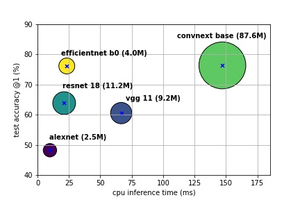
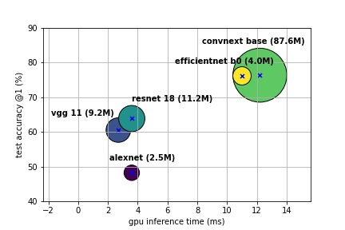

# 2D Backbones

## Models

### Alexnet

### VGG

### Resnet

### Convnext

TBD...

### EfficientNet

## Experiments' configurations

**Dataset**: `CUB_200_2011`(birds classification).

**Inference timing**: end-to-end, 2500 iterations with an input being a `1500x1500x3 uint8` tensor.

**Training's configurations** :

|               | alexnet | vgg 11 | resnet 18 | convnext base | efficientnet b0 |
|---------------|---------|--------|-----------|---------------|-----------------|
| batch size    | 512     | 256    | 512       | 64            | 256             |
| learning rate | 6e-4    | 7e-4   | 1e-3      | 6e-4          | 2e-3            |
| epochs        | 30      | 30     | 30        | 30            | 30              |

## Results

### Train and Test logs

[alexnet.out](logs/alexnet.out)

vgg.out TBD...

[resnet.out](logs/resnet.out)

convnext.out TBD...

efficient.out TBD..

### Accuracy vs Performance on CPU vs Model size

**CPU** : `Intel(R) Xeon(R) CPU E5-2667 v3 @ 3.20GHz`

### Accuracy vs Performance on GPU vs Model size

**GPU**: `NVIDIA Quadro RTX 6000`

## Attribution

Most of the code here was inspired by [bentrevett/pytorch-image-classification](https://github.com/bentrevett/pytorch-image-classification). 
As such, the LICENSE found there is also included here.